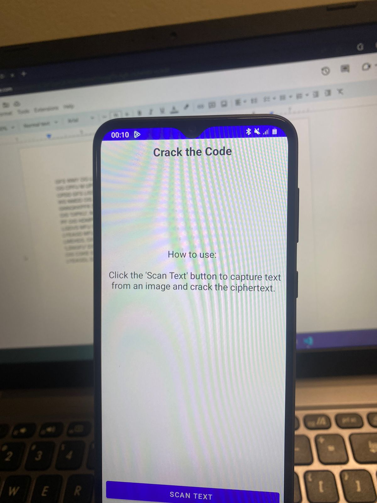

# Crack the Code

 This android application takes a picture of an encryted text, decrypts it and produces the plain-text
 
 How the text was decrypted~ Material/Decryption.pdf

## How To Use

    1.Download and install the apk on any android device.
    2.Open the App and Click on 'scan text', take a clear picture of the text.
    3.Click the checkmark ✓ and the decrypted text will be shown on screen.

